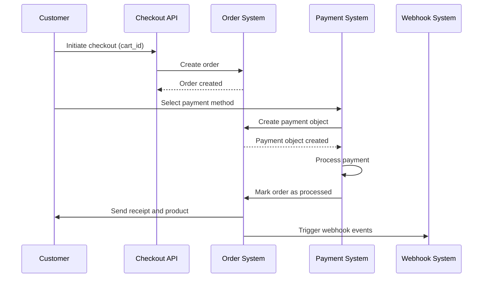
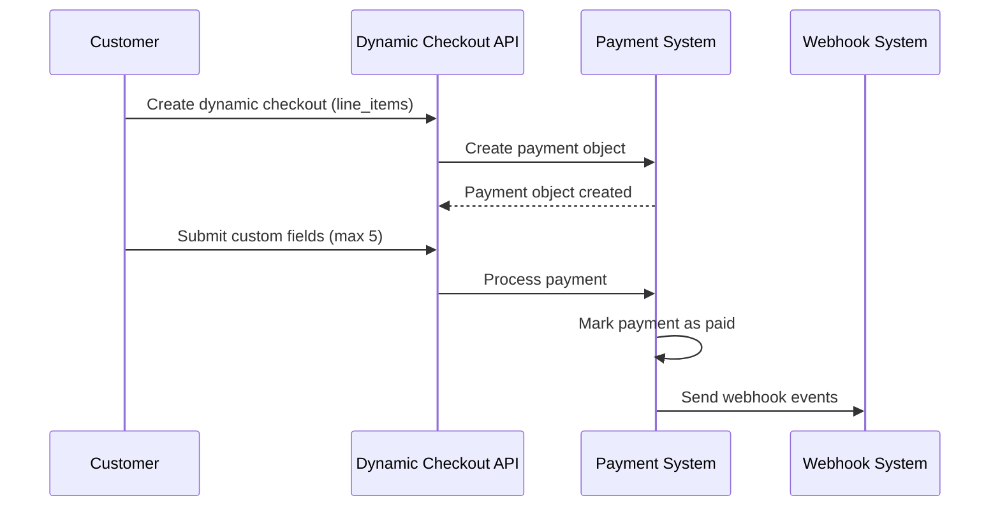

## Standard Checkouts

Standard checkouts are used for one-time purchases of products or services. This applies to products of type: `ONE_TIME`, `SERVICE`, `SERIAL`, or `LICENSE`.

- A customer selects one or more products and initiates checkout.
- The checkout API is called with a `cart_id` parameter.
- An order object is created.
- When the user selects a payment method, a payment object is created.
- An order can have multiple payments (stored as an array of payment objects).
- Once the payment is completed, the order is marked as processed.
- A receipt and the product are sent to the user.
- Webhook events are triggered to notify your system of the completed transaction.

## Dynamic Checkouts

Dynamic checkouts are used for non-standard, one-time charges where you don't have a pre-defined product.

- No static product is required; charges are calculated dynamically.
- A payment object is created directly, without an associated order.
- The payment is marked as paid once completed.
- Webhook events are sent based on your integration configuration.
- The API accepts `line_items[{ name, price }]` in the request body.
- You can request up to 5 custom fields from the customer during checkout.
- Customer inputs are sent to you via webhook and displayed on the dashboard.

## Subscriptions

## Invoices
