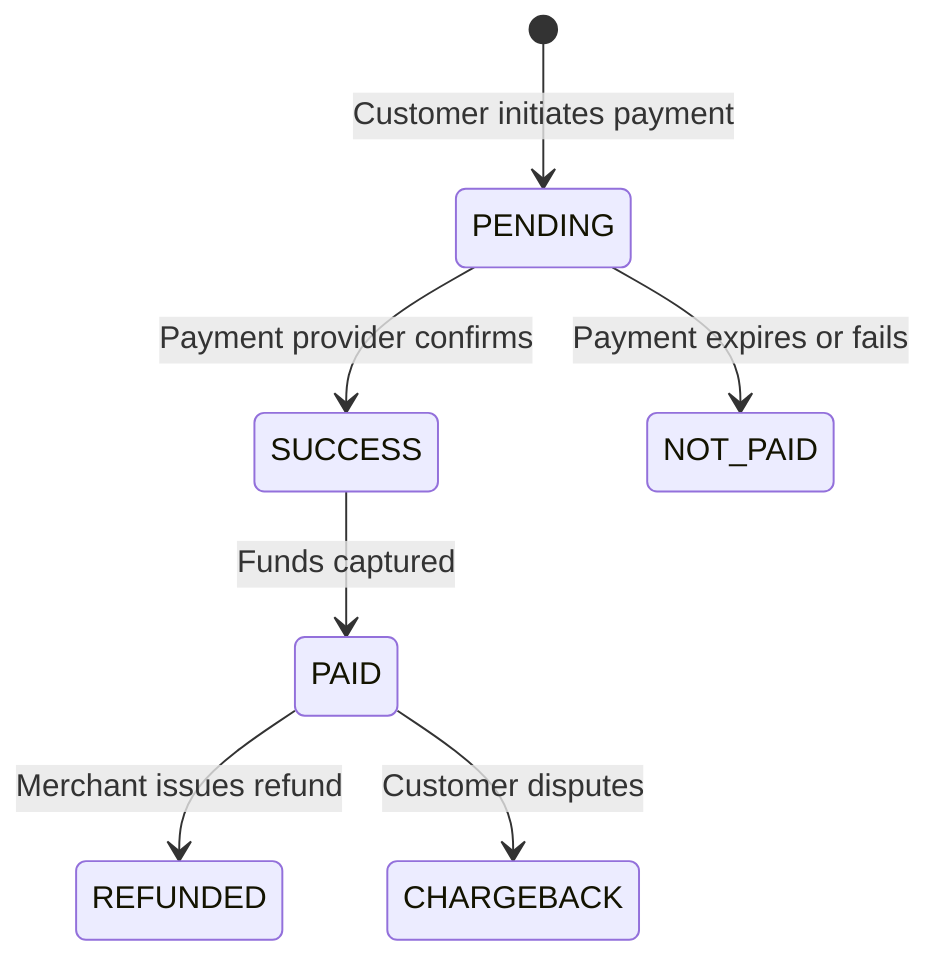

Every payment in Pandabase follows a defined lifecycle from creation to completion. Understanding this lifecycle helps you build reliable integrations and handle edge cases.

## Overview



## Transaction statuses

| Status | Description |
|--------|-------------|
| `PENDING` | Payment intent created, awaiting customer action |
| `SUCCESS` | Payment confirmed by the provider |
| `PAID` | Funds have been captured |
| `NOT_PAID` | Payment expired, was declined, or failed |
| `REFUNDED` | Payment was refunded to the customer |
| `CHARGEBACK` | Customer filed a dispute with their bank |

## Order statuses

| Status | Description |
|--------|-------------|
| `PENDING` | Order created, awaiting payment |
| `PROCESSING` | Payment received, order is being processed |
| `COMPLETED` | Order fulfilled |
| `CANCELLED` | Order was cancelled |
| `FAILED` | Payment failed |
| `REFUNDED` | Order was refunded |
| `CHARGEBACK` | A dispute was opened on this order |

## Lifecycle flow

### 1. Payment initiated

When a customer proceeds to pay, an order and transaction are created with `PENDING` status. A `payment.pending` webhook event is fired.

```json
{
  "object": "payment",
  "event": {
    "type": "payment.pending",
    "id": "ord_abc123",
    "data": {
      "order": { "status": "PENDING", ... },
      "transaction": { "status": "PENDING", ... },
      "customer": { "email": "customer@example.com" }
    }
  }
}
```

### 2. Payment succeeds

Once the payment provider confirms the payment, the transaction moves to `SUCCESS` and then `PAID`. The order status moves to `PROCESSING`. Two webhook events are fired in sequence:

- `payment.success` — includes `order` (with `custom_fields` if defined) and `transaction`
- `payment.paid` — includes `transaction`

<Note>
  `payment.success` is the primary event to listen for when fulfilling orders.
  It fires when the payment is confirmed and includes the full order data.
</Note>

### 3. Payment fails

If the payment is declined, expires, or the customer abandons checkout, the transaction moves to `NOT_PAID`. A `payment.not_paid` webhook event is fired with `order` and `transaction` data.

### 4. Refund

When a merchant issues a refund, the transaction status changes to `REFUNDED` and the order status changes to `REFUNDED`. A `payment.refunded` webhook event is fired with `transaction` data.

### 5. Dispute

If a customer opens a chargeback with their bank, the transaction status changes to `CHARGEBACK` and the order status changes to `CHARGEBACK`. A `payment.disputed` webhook event is fired with `transaction` data.

## Webhook events by lifecycle stage

| Stage | Event | Data included |
|-------|-------|---------------|
| Payment initiated | `payment.pending` | `order`, `transaction`, `customer` |
| Payment confirmed | `payment.success` | `order`, `transaction` |
| Funds captured | `payment.paid` | `transaction` |
| Payment failed | `payment.not_paid` | `order`, `transaction` |
| Refund issued | `payment.refunded` | `transaction` |
| Dispute opened | `payment.disputed` | `transaction` |