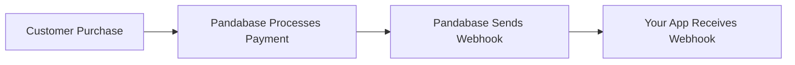
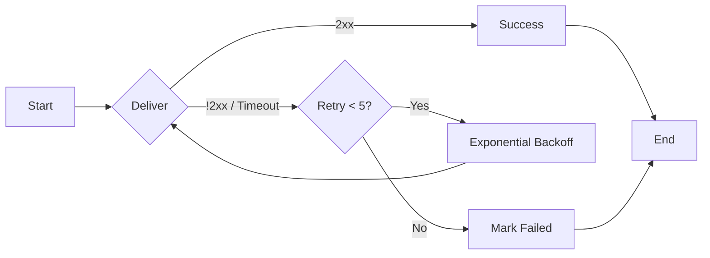

## Why should I use webhooks?

Pandabase webhooks can help you build real-time systems and facilitate
payment acceptance. If you intend to provide something to a user immediately
after a purchase, you can leverage webhook events.



## Event Overview

We generate event data and send it to your webhook. There are different event types as mentioned in [events](/developers/webhooks/events). For example, when a payment is completed successfully, a `payment.success` event is sent to your endpoint with the order and transaction data. We automatically send this immediately once a resource is updated in our system.

### The event object payload

Every webhook delivery is a JSON `POST` request with the following structure:

```json
{
  "object": "payment",
  "event": {
    "type": "payment.success",
    "id": "ord_abc123",
    "created_at": 1707400000000,
    "data": {
      "order": {
        "id": "ord_abc123",
        "order_number": "inv_xyz789",
        "status": "PROCESSING",
        "amount": 2999,
        "currency": "USD",
        "gateway": "STRIPE",
        "custom_fields": []
      },
      "transaction": {
        "id": "txn_def456",
        "transaction_id": "pi_stripe_xxx",
        "status": "SUCCESS",
        "amount": 3199,
        "fee": 200,
        "currency": "USD",
        "method": "STRIPE"
      }
    }
  }
}
```

### Headers

Every webhook delivery includes the following headers:

| Header | Description |
|--------|-------------|
| `X-Pandabase-Signature` | HMAC-SHA256 hex digest of the JSON body, signed with your webhook secret |
| `X-Pandabase-Timestamp` | Unix timestamp (milliseconds) of when the delivery was sent |
| `X-Pandabase-Idempotency` | Unique delivery identifier for deduplication |

### Retries

We retry up to 5 times, with each attempt delayed using exponential backoff starting at 1 second. If we receive a `2xx` status from your application, we mark the delivery as successful. Any other status code or a timeout (15 seconds) is treated as a failure and triggers a retry.



## Verification

To ensure security, always verify webhooks.

Webhooks can be verified to ensure they were actually sent by Pandabase and not
by a malicious entity.

To verify a webhook, you will need your webhook secret to confirm the
`SHA256` HMAC signature. Check the `X-Pandabase-Signature` header in the webhook request headers.

Here are several examples:

<CodeGroup>

```typescript TypeScript
import crypto from "crypto";
import { Request, Response, NextFunction } from "express";

function validateSignature(req: Request, res: Response, next: NextFunction) {
  const signature = req.headers["x-pandabase-signature"] as string;

  if (!signature) return res.status(401).send("Missing signature");

  try {
    const expected = crypto
      .createHmac("sha256", process.env.PANDABASE_WEBHOOK_SECRET!)
      .update(JSON.stringify(req.body))
      .digest("hex");

    const valid = crypto.timingSafeEqual(
      Buffer.from(signature, "hex"),
      Buffer.from(expected, "hex")
    );

    if (valid) {
      next();
    } else {
      res.status(401).send("Invalid signature");
    }
  } catch {
    res.status(401).send("Invalid signature");
  }
}

export { validateSignature };
```

```python Python
import hmac
import hashlib
import json
from flask import Flask, request, jsonify

app = Flask(__name__)

WEBHOOK_SECRET = b"wh_sk_xxx"

@app.route("/webhook", methods=["POST"])
def handle_webhook():
    signature = request.headers.get("X-Pandabase-Signature", "")
    expected = hmac.new(WEBHOOK_SECRET, request.data, hashlib.sha256).hexdigest()

    if hmac.compare_digest(expected, signature):
        event = request.json
        event_type = event["event"]["type"]

        if event_type == "payment.success":
            order = event["event"]["data"]["order"]
            print(f"Payment succeeded for order {order['id']}")

        return jsonify(message="OK"), 200
    else:
        return jsonify(message="Invalid signature"), 401

if __name__ == "__main__":
    app.run(debug=True)
```

```go Go
package main

import (
	"crypto/hmac"
	"crypto/sha256"
	"encoding/hex"
	"io"
	"net/http"
)

var webhookSecret = []byte("wh_sk_xxx")

func verifySignature(body []byte, signature string) bool {
	mac := hmac.New(sha256.New, webhookSecret)
	mac.Write(body)
	expected := hex.EncodeToString(mac.Sum(nil))
	return hmac.Equal([]byte(expected), []byte(signature))
}

func webhookHandler(w http.ResponseWriter, r *http.Request) {
	body, _ := io.ReadAll(r.Body)
	signature := r.Header.Get("X-Pandabase-Signature")

	if !verifySignature(body, signature) {
		http.Error(w, "Invalid signature", http.StatusUnauthorized)
		return
	}

	w.WriteHeader(http.StatusOK)
}

func main() {
	http.HandleFunc("/webhook", webhookHandler)
	http.ListenAndServe(":3000", nil)
}
```

</CodeGroup>

This code calculates the HMAC signature by hashing the raw JSON body of the
webhook payload using the SHA256 algorithm and your webhook secret. The result
is compared against the `X-Pandabase-Signature` header to verify authenticity.
