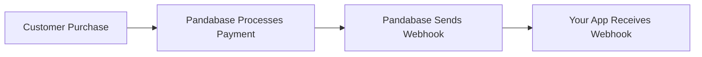

## Why should I use webhooks?

Pandabase webhooks can help you build real-time systems and facilitate
payment acceptance. If you intend to provide something to a user immediately
after a purchase, you can leverage webhook events.



## Event Overview

We generate event data and send it to your webhook. There are different event types as mentioned in [events](/developers/webhooks/events). For example, if you want updates on payments, you can use the `payment.updated` event to receive an update about the payment in your application. We automatically send this immediately once a resource is created in our system.

### The event object payload

Here's an example:

```json
{
  "type": "payment.created",
  "webhook_id": "",
  "data": {
    ...paymentResource
  }
}
```

### Retries

We retry up to 5 times, with each attempt delayed using an exponential backoff. If we receive a 200 status from your application, we mark the delivery as successful. Otherwise, if anything other than 200 is received, we try 5 times max. If it doesn't succeed after 5 attempts, we email you and mark the webhook as disabled.


## Verification

To ensure security, always verify webhooks.

Webhooks can be verified to ensure they were actually sent by Pandabase and not
by a malicious entity.

To verify a webhook, you will need your webhook secret or token to confirm the
`SHA256` HMAC signature. Check the `X-Pandabase-Signature` header in the webhook response headers.

Here are several examples:

<CodeGroup>

```typescript TypeScript
import crypto from "crypto";
import { Request, Response } from "express";

const secret = "wh_";

function validateSignature(req: Request, res: Response) {
  const signature = crypto
    .createHmac("sha256", secret)
    .update(JSON.stringify(req.body))
    .digest("hex");

  if (req.headers["x-pandabase-signature"] === signature) {
    console.log("Valid signature. The response was sent by Pandabase.");
    res.status(200).send("Request processed");
  } else {
    console.log("Invalid signature.");
    res.status(401).send("Invalid signature");
  }
}
```

```python Python
import hmac
import hashlib
import json
from flask import Flask, request, jsonify

app = Flask(__name__)

SECRET = b'wh_'  # paste your secret here

@app.route('/webhook', methods=['POST'])
def validate_signature():
    signature = hmac.new(SECRET, request.data, hashlib.sha256).hexdigest()

    if hmac.compare_digest(signature, request.headers.get('X-Pandabase-Signature', '')):
        print('Valid signature. The response was sent by Pandabase.')
        return jsonify(message="Request processed"), 200
    else:
        print('Invalid signature.')
        return jsonify(message="Invalid signature"), 401

if __name__ == '__main__':
    app.run(debug=True)
```

```go Go
package main

import (
	"crypto/hmac"
	"crypto/sha256"
	"encoding/hex"
	"encoding/json"
	"fmt"
	"net/http"
)

func main() {
	secret := "wh_" // paste your secret here

	http.HandleFunc("/", func(w http.ResponseWriter, r *http.Request) {
		var body map[string]interface{}
		if err := json.NewDecoder(r.Body).Decode(&body); err != nil {
			http.Error(w, "Error reading request body", http.StatusBadRequest)
			return
		}

		h := hmac.New(sha256.New, []byte(secret))
		jsonBody, _ := json.Marshal(body)
		h.Write(jsonBody)
		signature := hex.EncodeToString(h.Sum(nil))

		if r.Header.Get("X-Pandabase-Signature") == signature {
			fmt.Println("Valid signature. The response was sent by Pandabase.")
		} else {
			fmt.Println("Invalid signature.")
		}
	})

	http.ListenAndServe(":8080", nil)
}
```

```rust Rust
use actix_web::{web, App, HttpRequest, HttpResponse, HttpServer, Responder};
use hmac::{Hmac, Mac};
use sha2::Sha256;
use serde_json::Value;

type HmacSha256 = Hmac<Sha256>;

const SECRET: &str = "wh_"; // paste your secret here

async fn validate_signature(req: HttpRequest, body: web::Json<Value>) -> impl Responder {
    let mut mac = HmacSha256::new_from_slice(SECRET.as_bytes())
        .expect("HMAC can take key of any size");

    mac.update(serde_json::to_string(&body).unwrap().as_bytes());

    let signature = hex::encode(mac.finalize().into_bytes());

    match req.headers().get("x-pandabase-signature") {
        Some(header) if header == signature.as_str() => {
            println!("Valid signature. The response was sent by Pandabase.");
            HttpResponse::Ok().body("Request processed")
        }
        _ => {
            println!("Invalid signature.");
            HttpResponse::Unauthorized().body("Invalid signature")
        }
    }
}

#[actix_web::main]
async fn main() -> std::io::Result<()> {
    HttpServer::new(|| {
        App::new().route("/webhook", web::post().to(validate_signature))
    })
    .bind("127.0.0.1:8080")?
    .run()
    .await
}
```

</CodeGroup>

This code calculates the HMAC signature by hashing the JSON string of the
webhook payload using the SHA256 algorithm and the provided secret. The result
is a hexadecimal digest.
