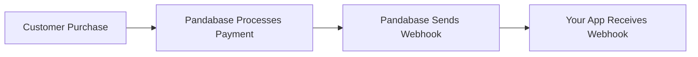
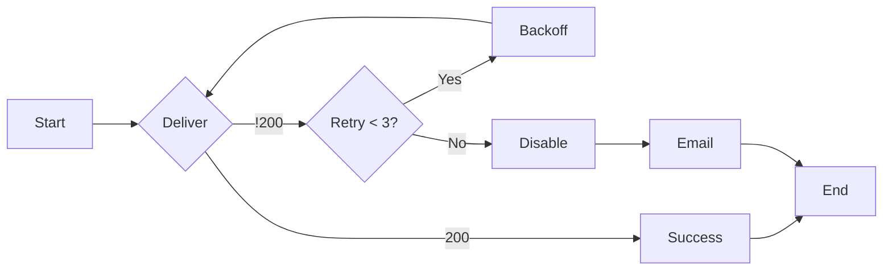

## Why should I use webhooks?

Pandabase webhooks can help you build real-time systems and facilitate
payment acceptance. If you intend to provide something to a user immediately
after a purchase, you can leverage webhook events.



## Event Overview

We generate event data and send it to your webhook. There are different event types as mentioned in [events](/developers/webhooks/events). For example, if you want updates on payments, you can use the `payment.updated` event to receive an update about the payment in your application. We automatically send this immediately once a resource is created in our system.

### The event object payload

Here's an example:

```json
{
  "id": "",
  "type": "payment.created",
  "data": {
    ...paymentResource
  }
}
```

### Retries

We retry up to 3 times, with each attempt delayed using an exponential backoff. If we receive a 200 status from your application, we mark the delivery as successful. Otherwise, if anything other than 200 is received, we try 3 times max. If it doesn't succeed after 3 attempts, we email you and mark the webhook as disabled.



## Verification

To ensure security, always verify webhooks.

Webhooks can be verified to ensure they were actually sent by Pandabase and not
by a malicious entity.

To verify a webhook, you will need your webhook secret or token to confirm the
`SHA256` HMAC signature. Check the `X-Webhook-Signature` header in the webhook response headers.

Here are several examples:

<CodeGroup>

```typescript TypeScript
import crypto from "crypto";
import { Request, Response } from "express";

function validateSignature(req: Request, res: Response) {
  if (!req.headers["x-webhook-signature"]) return res.status(401).send();
  try {
    const valid = crypto.timingSafeEqual(
      Buffer.from(req.headers["x-webhook-signature"] as string, "hex"),
      Buffer.from(
        crypto
          .createHmac("sha256", "wh_")
          .update(JSON.stringify(req.body))
          .digest("hex"),
        "hex"
      )
    );
    res.status(valid ? 200 : 401).send();
  } catch {
    res.status(401).send();
  }
}

export { validateSignature };
```

```python Python
import hmac
import hashlib
import json
from flask import Flask, request, jsonify

app = Flask(__name__)

SECRET = b'wh_'  # paste your secret here

@app.route('/webhook', methods=['POST'])
def validate_signature():
    signature = hmac.new(SECRET, request.data, hashlib.sha256).hexdigest()

    if hmac.compare_digest(signature, request.headers.get('X-webhook-Signature', '')):
        print('Valid signature. The response was sent by Pandabase.')
        return jsonify(message="Request processed"), 200
    else:
        print('Invalid signature.')
        return jsonify(message="Invalid signature"), 401

if __name__ == '__main__':
    app.run(debug=True)
```

</CodeGroup>

This code calculates the HMAC signature by hashing the JSON string of the
webhook payload using the SHA256 algorithm and the provided secret. The result
is a hexadecimal digest.
